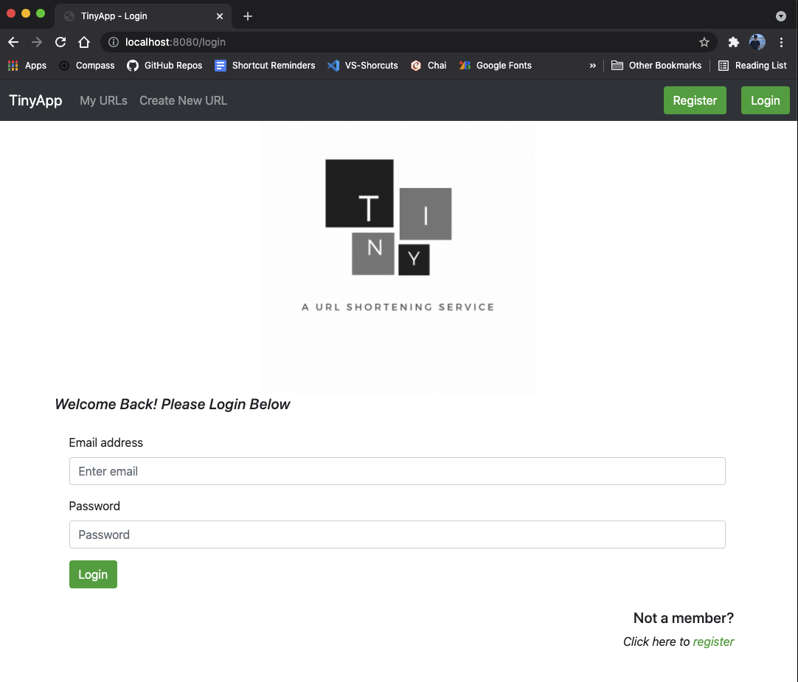
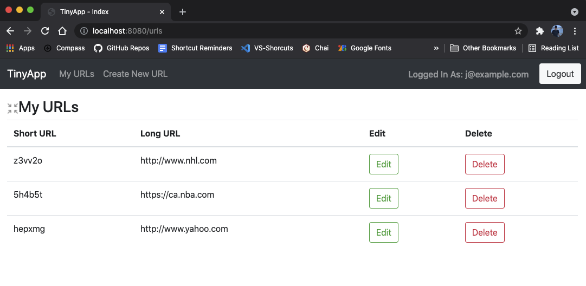
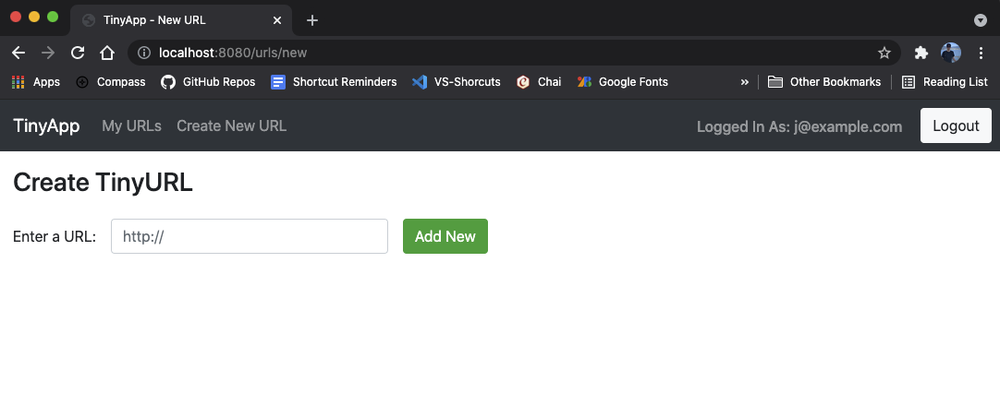

# TinyApp Project

TinyApp is a full stack web application built with Node and Express that allows users to shorten long URLs (à la bit.ly).

__Author:__ [@wheeljust](https://github.com/wheeljust/)

*TinyApp was created as a project for Lighhouse Labs Web Development Bootcamp*
_____

## Final Product:

## Dependencies:

- Node.js
- Express
- EJS
- bcrypt
- body-parser
- cookie-session

## Getting Started:

- Install all dependencies (using the `npm install` command).

- Run the development web server using the `npm start` command.
  - The default PORT is set to run on the users machine (localhost) on PORT: 8080

- Once the server is running, test the application in your browser by visiting [localhost:8080/login](http://localhost:8080/login)

- Create an account on the TinyApp server using a valid email address and password.

- Start shrinking links!